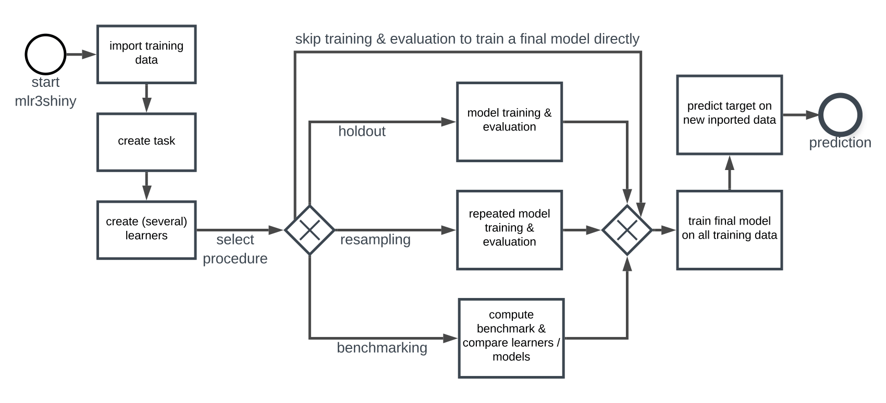

---
title: 'mlr3shiny: A graphical user interface for machine learning in R'
tags:
  - R
  - shiny
  - machine learning
  - data science
  - graphical user interface
  - supervised learning
authors:
  - name: Laurens M. Tetzlaff
    orcid: 0000-0001-9560-2669
    affiliation: ??
  - name: Gero Szepannek
    orcid:
    affiliation: ??
affiliations:
 - name: 
   index: 1
 - name: 
   index: 2
date: 31 January 2020
bibliography: paper.bib

# Summary
The R `[@rcore:2010]` package mlr3shiny provides the basic steps of a machine learning (ML) workflow in form of a user-friendly web-application.
As such the access to ML for users unfamiliar with R or coding is facilitated. 
The graphical user interface that Shiny `[@shiny:2019]` offers is combined with the powerful object-orientated and standardized ML framework mlr3 `[@mlr3:2019]` Thus, state-of-the-art ML functionalites can be referenced and applied in an easy to use point-and-click fashion accessible over the web freeing users from coding in R.

The layout of the application visually guides its users chronologically through the different steps of the machine learning workflow. The application is designed in such a way that users new to this field can successfully conduct a machine learning experiment, the process of creating a ML problem, a task, to training a model and making a prediction.

The core functionalities are:
* Data import (various file formats)
* Creation of a task for supervised learning (regression, classification)
* Use of a set of algorithms as learners to compute ML models
* Training and evaluation of the generated models
* Resampling and benchmarking to compare several learners on a task simultaneously
* Prediction on new data using the final model

The different steps of the workflow are accompanied by additional information about the given functionalities and statistical features. Moreover, at each point in time, the generated results and predictions can be downloaded for further inspection, processing and to use them in other research. As a result, a full ML process is supported. To guard new users from committing easy mistakes and to provide orientation, default input values and examples are given in accordance with current practices. On top, it is ensured that conducted experiments are replicable.   

In conclusion, mlr3shiny is ideally used in teaching, as an interactive introduction to the field of statistical learning or as a fast and efficent way of trying out and comparing different algorithms on a ML problem in a first step of a more complex machine learning workflow.

# Acknowledgements

We acknowledge contributions from Rabea Aschenbruck during the genesis of this project.

# References